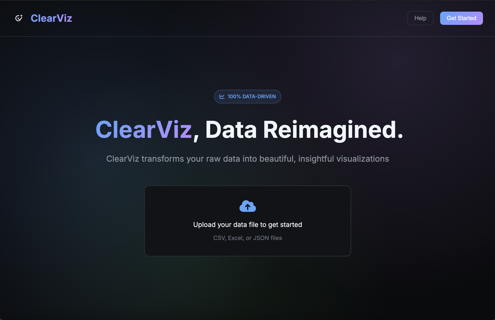

<div align="center">

# ClearViz - Data Visualizer



**ClearViz** is a fully open source data analyzing assistant that helps you accomplish real-world data tasks, providing valuable insights for businesses along the way. Through conversation about already-powerful data insights provided following dataset uploads, ClearViz adapts to personal and business needs for data analysis and contemporary business challenges. 

By combining the mind of an AI with intuitive insights, ClearViz helps you get the job done in achieving the next step towards maximum business efficiency. 

**AI AGENT COMING SOON**

[](./license)
[](https://github.com/sxashwathr/ClearViz/labels/bug)

</div>

## Table of Contents

- [ClearViz Build](#build)
- [Self-Hosting](#self-hosting)
- [Acknowledgements](#acknowledgements)
- [License](#license)

## Build

## Self-hosting

### Prerequisites
- Node.js (version 14 or higher) - [Download here](https://nodejs.org/)
- Git - [Download here](https://git-scm.com/)

For git download, `$ git --version` will prompt you to download the latest version. 

Navigate to Terminal (Mac/Linux) or Command Prompt (Windows), and enter the following commands.

1. **Clone and Navigate to this repo:**
```bash
git clone https://github.com/sxashwathr/ClearViz/
```
```bash
cd ClearViz
```
2. **Install Nodejs dependences:**
```bash
npm install
```
3. **Start the application locally:**
```bash
npm start

```
4. **Navigate to your main browser (ports may vary):**
```bash
http://localhost:3000
```
The application will automatically open in your default browser.

### Troubleshooting
- If you get permission errors, try `sudo npm install` (Mac/Linux) or run as administrator (Windows)
- If port 3000 is busy, the app will use the next available port (Note: you're port might not be 3000)
- Make sure Node.js is installed: `node --version`

### More coming soon with the release of AI insights...

## Acknowledgements

### Contributors:
- Sashwath Ravishankar
- Raghav Reddy

## License

